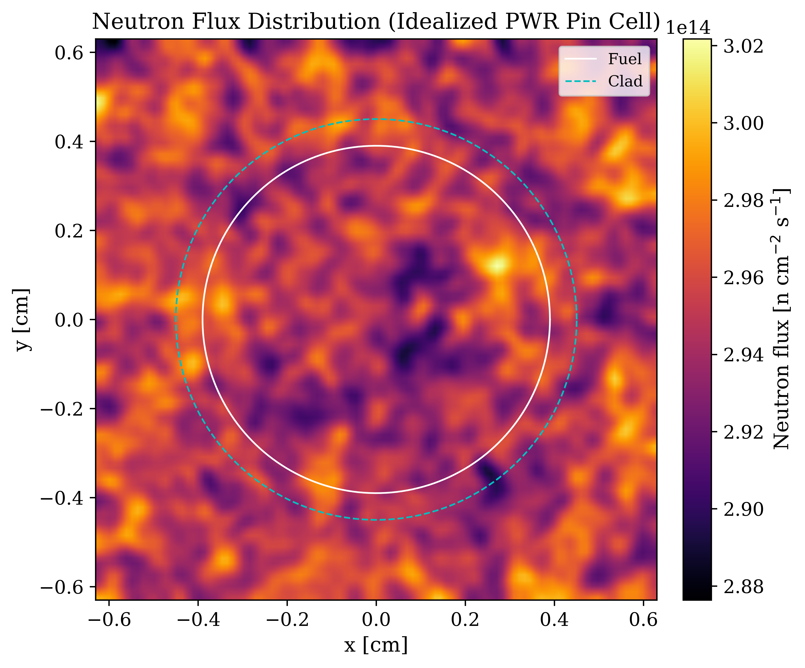
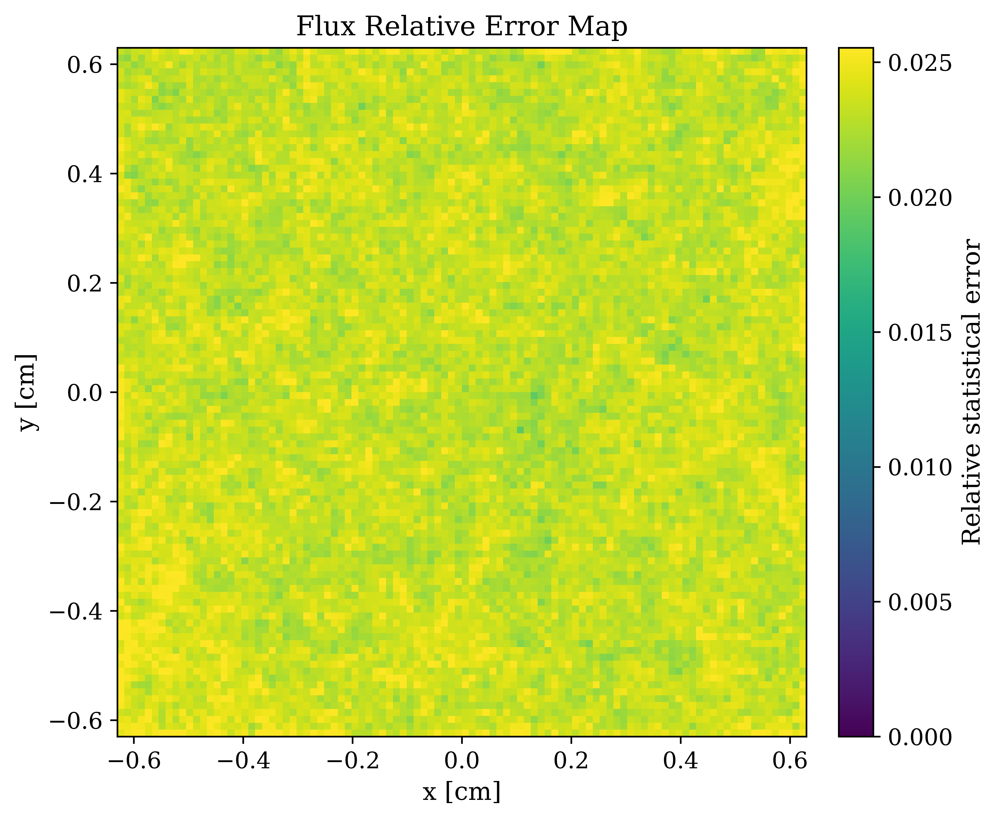
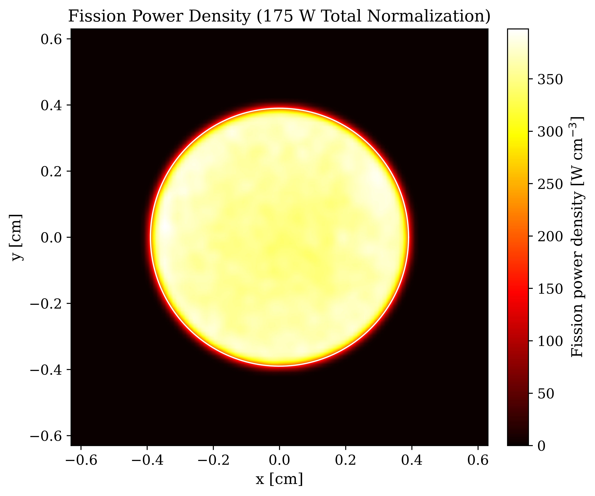
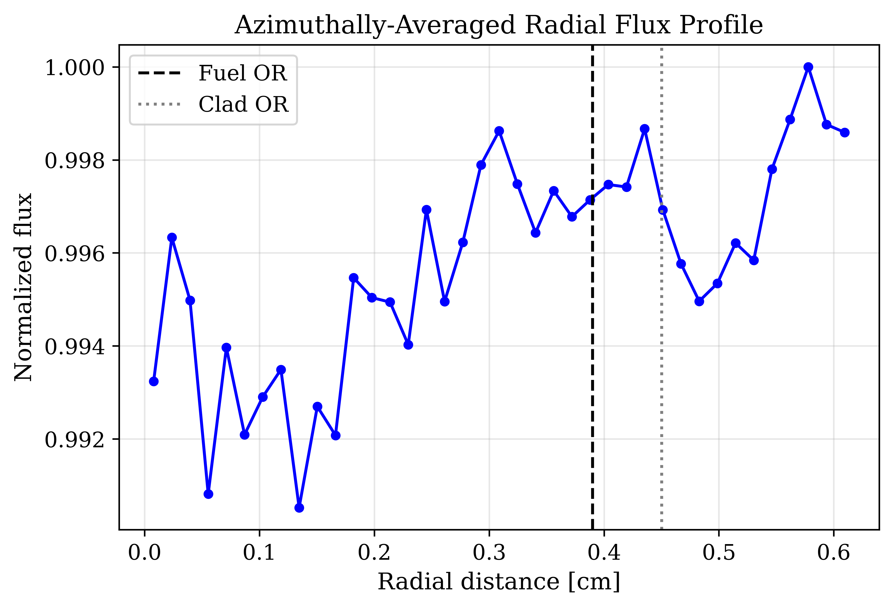
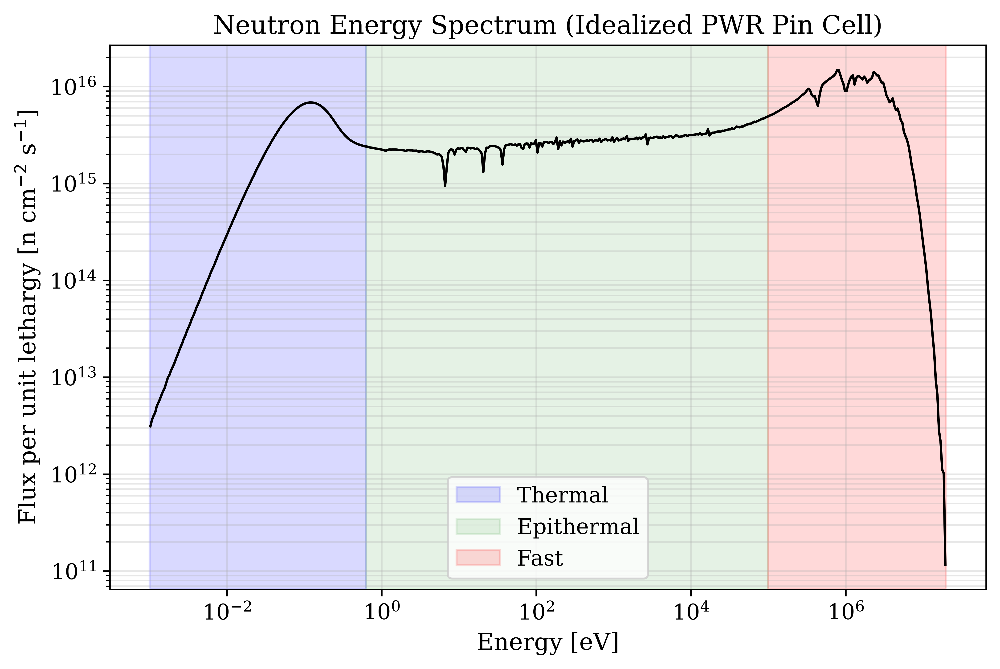
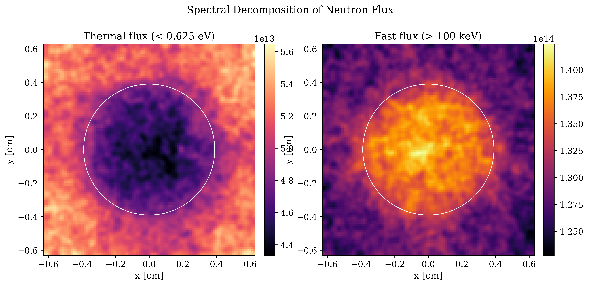
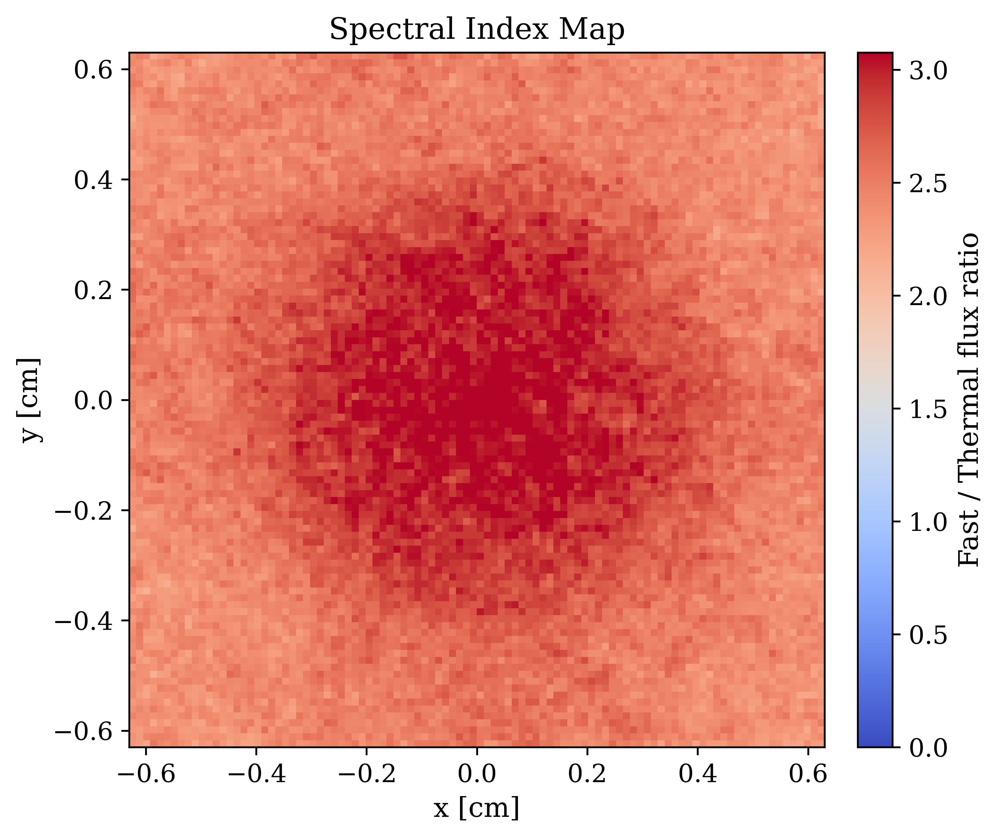
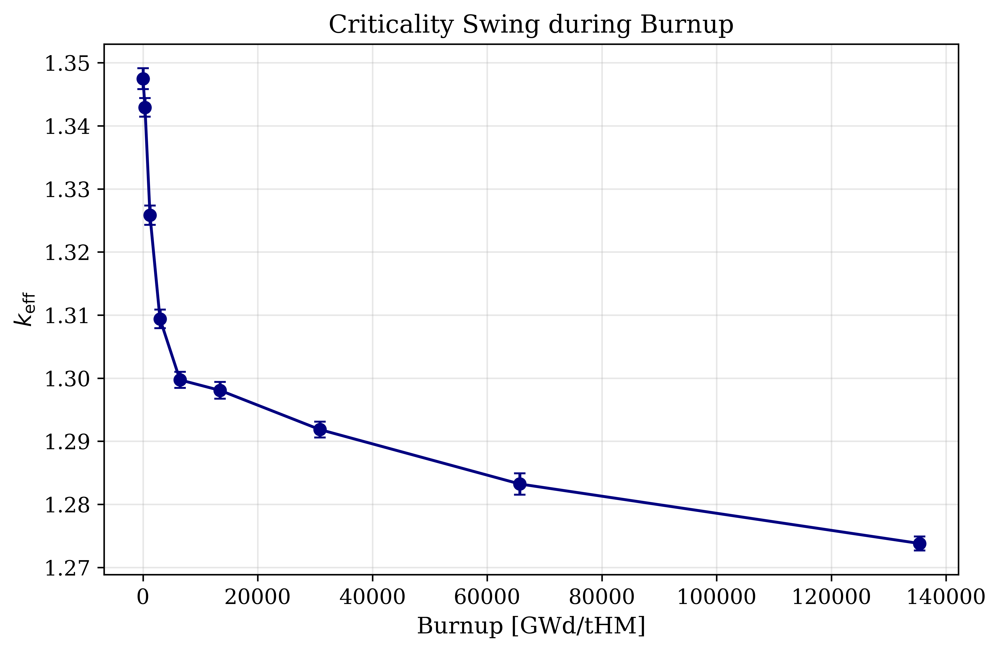
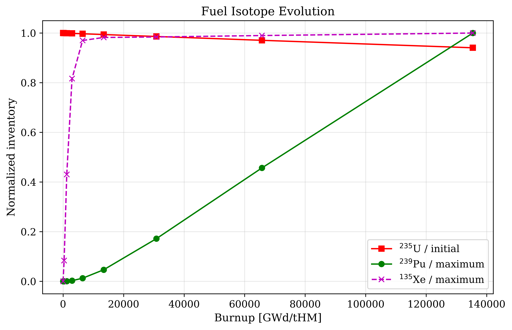

# High-Fidelity Monte Carlo Neutronics of an Idealized PWR Fuel Pin Cell

[](https://openmc.org/)
[](https://www.nndc.bnl.gov/endf/)
[](https://www.kaggle.com/code/afridijubairuthso/pwr-pincell-openmc-neutronics/output?scriptVersionId=355667635)

A research-oriented **continuous-energy Monte Carlo neutronics workflow for an idealized unborated infinite-lattice PWR fuel pin cell**, developed with [OpenMC](https://openmc.org/).

The project combines **fresh-state criticality**, **estimator cross-checking**, **spatial neutron-flux and fission-power mapping**, **continuous-energy spectral analysis**, **thermal/fast flux decomposition**, **spectral-index mapping**, and **fuel depletion/burnup** in one reproducible workflow.

> **Model scope:** This is an **idealized unborated PWR pin-cell model**, not a full-core or fully realistic reactor model. It is intended to demonstrate computational neutronics methodology and provide a research portfolio artifact.

---

## Contents

- [Project at a glance](#project-at-a-glance)
- [Research questions](#research-questions)
- [Model and assumptions](#model-and-assumptions)
- [Computational workflow](#computational-workflow)
- [Fresh-state criticality](#fresh-state-criticality)
- [Spatial flux and power](#spatial-flux-and-power)
- [Energy spectrum and spectral decomposition](#energy-spectrum-and-spectral-decomposition)
- [Depletion and burnup](#depletion-and-burnup)
- [Results at a glance](#results-at-a-glance)
- [Figures](#figures)
- [Repository structure](#repository-structure)
- [Reproducibility](#reproducibility)
- [Interpretation and limitations](#interpretation-and-limitations)
- [Research extensions](#research-extensions)
- [Author](#author)

---

## Project at a glance

### What is modeled?

| Item | Model |
|---|---|
| Reactor concept | Pressurized Water Reactor (PWR) |
| Geometry | Single fuel pin cell / infinite lattice |
| Boundary condition | Reflective lateral boundaries |
| Fuel | UO₂, 3.2 wt% ²³⁵U |
| Fuel density | 10.3 g/cm³ |
| Fuel radius | 0.39 cm |
| Cladding | Natural-Zr / Zircaloy representation |
| Cladding density | 6.55 g/cm³ |
| Cladding radius | 0.45 cm |
| Lattice pitch | 1.26 cm |
| Moderator | Light water |
| Moderator density | 0.7 g/cm³ |
| Thermal scattering | H in H₂O, `c_H_in_H2O` |
| Fuel temperature | 900 K |
| Moderator temperature | 580 K in the fresh-state model |
| Nuclear data | ENDF/B-VII.1 |
| Depletion chain | PWR depletion chain based on ENDF/B-VII.1 |
| Transport | Continuous energy |
| Fresh-state particles | 50,000 / batch |
| Fresh-state batches | 200 |
| Inactive batches | 40 |
| Spatial mesh | 100 × 100 × 1 |
| Spectrum bins | 500 logarithmic bins |
| Power normalization | 175 W total for a 1 cm axial model |

---

## Research questions

The notebook is designed to answer a sequence of increasingly detailed neutronics questions:

1. **Criticality:** What is the fresh-state multiplication factor of the idealized pin cell?
2. **Estimator consistency:** Do collision, track-length, absorption, and combined eigenvalue estimators agree within their statistical uncertainties?
3. **Spatial behavior:** How does neutron flux vary across the fuel, cladding, and moderator regions?
4. **Power distribution:** Where is fission energy deposition concentrated?
5. **Spectral behavior:** What does the continuous-energy neutron spectrum look like?
6. **Spatial spectral behavior:** Where are the thermal and fast neutron populations concentrated?
7. **Spectral index:** How does the local fast-to-thermal flux ratio vary spatially?
8. **Depletion:** How do ²³⁵U, ²³⁹Pu, ¹³⁵Xe, and `k_eff` evolve as the fuel is depleted?

---

# Computational workflow

```text
                 ┌──────────────────────────────┐
                 │  Idealized PWR pin cell      │
                 │  UO₂ / Zircaloy / H₂O        │
                 └──────────────┬───────────────┘
                                │
                                ▼
                    ┌───────────────────────┐
                    │ ENDF/B-VII.1 data     │
                    │ Continuous-energy     │
                    └───────────┬───────────┘
                                │
              ┌─────────────────┴─────────────────┐
              │                                   │
              ▼                                   ▼
     ┌──────────────────┐               ┌──────────────────┐
     │ Fresh criticality│               │ Depletion model  │
     │ 200 batches      │               │ Predictor        │
     │ 40 inactive      │               │ 175 W constant   │
     │ 50k particles    │               │ power            │
     └────────┬─────────┘               └────────┬─────────┘
              │                                  │
      ┌───────┼────────┐                 ┌───────┼────────┐
      ▼       ▼        ▼                 ▼       ▼        ▼
   k-eff   flux/power spectrum         k-eff   isotopes burnup
              │                                  │
              └────────────────┬─────────────────┘
                               ▼
                      High-quality Figures
```

---

# Fresh-state criticality

The fresh-state calculation uses:

- 200 total batches
- 40 inactive batches
- 50,000 particles per batch
- 160 active batches
- continuous-energy transport
- reflective boundaries

The final fresh-state combined eigenvalue reported by OpenMC is:

### **kₑff = 1.34905 ± 0.00032**

The independent estimator results are:

| Estimator | kₑff |
|---|---:|
| Collision | **1.34881 ± 0.00054** |
| Track-length | **1.34862 ± 0.00065** |
| Absorption | **1.34909 ± 0.00032** |
| Combined | **1.34905 ± 0.00032** |

The close agreement between the independent estimators is an important internal consistency check. The leakage fraction is effectively zero, as expected for the reflective infinite-lattice boundary treatment.

### Why is the first depletion `k_eff` different?

The first depletion state is **not the same numerical calculation as the high-statistics fresh-state run**.

The depletion model uses:

- 50 batches
- 15 inactive batches
- 12,000 particles/batch
- moderator temperature = 600 K
- a separate `CoupledOperator`
- the depletion chain
- the constant-power depletion normalization

Therefore, its initial depletion criticality is independently sampled and is expected to differ slightly from the high-statistics fresh-state value.

The first depletion result is:

**kₑff = 1.34747 ± 0.00167**

The difference from the fresh combined value is about 0.00158, which is comparable to the combined Monte Carlo uncertainty of the two calculations. Thus, the difference is **not evidence of an inconsistent physics model by itself**; it is consistent with the separate depletion setup and its much larger statistical uncertainty.

This distinction is deliberately documented rather than hiding the two values.

---

# Spatial flux and power

The model uses a **100 × 100 × 1 Cartesian mesh** over the 1.26 cm × 1.26 cm pin-cell cross section.

## Neutron flux

The spatial flux tally uses the OpenMC `flux` score with a track-length estimator.

The notebook converts the per-source-particle tally to physical neutron flux using the same source-rate normalization derived from the `kappa-fission` tally.

Reported unit:

**n cm⁻² s⁻¹**

The visualization applies Gaussian smoothing only for graphical readability. Quantitative processing is based on the raw tally values.



## Flux statistical uncertainty

A cell-by-cell relative statistical error map is also produced:



This is particularly useful because a visually attractive flux field alone does not demonstrate statistical quality.

## Fission power density

The `kappa-fission` tally is converted into physical power density using a specified reference power of:

**175 W total thermal power**

for the modeled **1 cm axial segment**.

The notebook derives the source rate from the integrated `kappa-fission` tally and verifies the normalization:

**Integrated normalized power = 175.000000 W**

The resulting plotted quantity is:

**W cm⁻³**



A radial, azimuthally averaged flux profile is also calculated:



---

# Energy spectrum and spectral decomposition

The spectrum uses 500 logarithmically spaced energy bins from approximately:

**1 meV to 20 MeV**

The spectrum is reported as flux per unit natural lethargy:

**n cm⁻² s⁻¹ per unit ln(E)**

The spectral visualization distinguishes:

- **Thermal:** E < 0.625 eV
- **Epithermal:** 0.625 eV ≤ E < 100 keV
- **Fast:** E ≥ 100 keV



## Thermal and fast flux maps

Separate mesh-filtered tallies provide spatial maps of:

- thermal flux below 0.625 eV
- fast flux above 100 keV



## Spectral index

A local spectral index is calculated as:

\[
I_s(x,y)=\frac{\phi_{\mathrm{fast}}(x,y)}
{\phi_{\mathrm{thermal}}(x,y)}
\]

where:

- `φ_fast` is the local flux above 100 keV
- `φ_thermal` is the local flux below 0.625 eV



This provides a compact spatial measure of spectral hardness.

---

# Depletion and burnup

The depletion calculation uses OpenMC's:

**`CoupledOperator` + `PredictorIntegrator`**

with the PWR depletion chain:

```text
/kaggle/input/datasets/afridijubairuthso/endfb71/chain_endfb71_pwr.xml
```

and ENDF/B-VII.1 cross sections.

## Explicit normalization

The depletion calculation uses:

**constant total thermal power = 175 W**

for a modeled axial height of:

**1.0 cm**

Therefore:

\[
P_\mathrm{linear}=175\ \mathrm{W/cm}
\]

The initial uranium heavy-metal mass calculated by the notebook is approximately:

**4.3383 g**

The depletion timestep sequence is:

```text
0.10 d
0.25 d
0.50 d
1.00 d
2.00 d
5.00 d
10.00 d
20.00 d
```

The early steps are deliberately smaller to better resolve the beginning of the depletion trajectory.

## Depletion `k_eff`

The combined `k_eff` results recorded from the depletion calculation are:

| Depletion state | Combined kₑff | 1σ |
|---:|---:|---:|
| Initial | 1.34747 | ±0.00167 |
| 0.10 d | 1.34292 | ±0.00148 |
| 0.35 d | 1.32584 | ±0.00152 |
| 0.85 d | 1.30940 | ±0.00147 |
| 1.85 d | 1.29973 | ±0.00128 |
| 3.85 d | 1.29807 | ±0.00132 |
| 8.85 d | 1.29185 | ±0.00126 |
| 18.85 d | 1.28323 | ±0.00169 |
| 38.85 d | 1.27380 | ±0.00111 |

The overall trend is a decrease in multiplication factor as the fuel is depleted.



### Important burnup note

The current notebook output contains a **unit-conversion error in the printed burnup value**: it reports 135,400.3913 GWd/tHM even though the depletion schedule sums to only 38.85 days at 175 W and the initial heavy-metal mass is about 4.3383 g.

Using the stated power, elapsed time, and heavy-metal mass, the physically consistent final burnup is approximately:

### **1.567 GWd/tHM**

Therefore, the `09_keff_burnup.png` figure should be regenerated after correcting the burnup conversion before this repository is presented as a finalized research artifact.

The conceptual depletion `k_eff` results themselves are retained; the issue is specifically the conversion of elapsed time/power/mass into the displayed GWd/tHM axis.

---

# Isotope evolution

The depletion tracks:

- ²³⁵U
- ²³⁹Pu
- ¹³⁵Xe

The notebook intentionally uses different normalization conventions because the initial inventories are fundamentally different:

- ²³⁵U → normalized to its initial value
- ²³⁹Pu → normalized to its maximum value
- ¹³⁵Xe → normalized to its maximum value

Thus the isotope plot is best interpreted as a **relative trajectory visualization**, not a direct comparison of absolute isotope concentrations.



The qualitative objectives are to demonstrate:

- depletion of fissile ²³⁵U
- buildup of bred ²³⁹Pu
- evolution of neutron-poisoning ¹³⁵Xe

For a quantitative isotope-inventory study, absolute atom densities or mass densities should be plotted in addition to normalized curves.

---

# Results at a glance

| Quantity | Result |
|---|---:|
| Fresh combined kₑff | **1.34905 ± 0.00032** |
| Fresh collision estimator | **1.34881 ± 0.00054** |
| Fresh track-length estimator | **1.34862 ± 0.00065** |
| Fresh absorption estimator | **1.34909 ± 0.00032** |
| Depletion initial combined kₑff | **1.34747 ± 0.00167** |
| Depletion final combined kₑff | **1.27380 ± 0.00111** |
| Total depletion time | **38.85 days** |
| Constant depletion power | **175 W** |
| Equivalent linear power | **175 W/cm** |
| Initial heavy-metal mass | **4.3383 g** |
| Corrected final burnup | **~1.567 GWd/tHM** |
| Mesh resolution | **100 × 100 × 1** |
| Spectrum bins | **500** |
| Fresh-state transport | **Continuous energy** |

---

# Figures

All principal figures are generated by the notebook.

| Figure | Description |
|---|---|
| [`02_flux_map.png`](figures/02_flux_map.png) | Spatial neutron-flux distribution |
| [`03_flux_rel_error.png`](figures/03_flux_rel_error.png) | Flux relative statistical error |
| [`04_power_density.png`](figures/04_power_density.png) | Physically normalized fission power density |
| [`05_radial_flux_profile.png`](figures/05_radial_flux_profile.png) | Azimuthally averaged radial flux |
| [`06_neutron_spectrum.png`](figures/06_neutron_spectrum.png) | Continuous-energy neutron spectrum |
| [`07_thermal_fast_maps.png`](figures/07_thermal_fast_maps.png) | Thermal and fast flux maps |
| [`08_spectral_index.png`](figures/08_spectral_index.png) | Fast/thermal spectral-index map |
| [`09_keff_burnup.png`](figures/09_keff_burnup.png) | Depletion `k_eff` trajectory |
| [`10_isotope_evolution.png`](figures/10_isotope_evolution.png) | Relative ²³⁵U/²³⁹Pu/¹³⁵Xe evolution |

High-resolution PDF versions are also retained for figures 02–08.

---

# Repository structure

Recommended repository name:

## `openmc-pwr-pincell-neutronics`

Suggested structure:

```text
openmc-pwr-pincell-neutronics/
│
├── README.md
│
├── notebooks/
│   └── pwr-pincell-openmc-neutronics.ipynb
│
├── figures/
│   ├── 02_flux_map.png
│   ├── 02_flux_map.pdf
│   ├── 03_flux_rel_error.png
│   ├── 03_flux_rel_error.pdf
│   ├── 04_power_density.png
│   ├── 04_power_density.pdf
│   ├── 05_radial_flux_profile.png
│   ├── 05_radial_flux_profile.pdf
│   ├── 06_neutron_spectrum.png
│   ├── 06_neutron_spectrum.pdf
│   ├── 07_thermal_fast_maps.png
│   ├── 07_thermal_fast_maps.pdf
│   ├── 08_spectral_index.png
│   ├── 08_spectral_index.pdf
│   ├── 09_keff_burnup.png
│   └── 10_isotope_evolution.png
│
├── results/
│   ├── statepoint.200.h5
│   ├── statepoint.50.h5
│   ├── depletion_results.h5
│   └── openmc_simulation_n*.h5
│
└── docs/
    └── methodology.md
```

The large HDF5 statepoint/depletion files are better handled with **Git LFS** rather than ordinary Git blobs.

---

# Reproducibility

The workflow was developed and executed in a Kaggle environment using OpenMC.

The nuclear-data workflow uses:

- ENDF/B-VII.1 continuous-energy neutron data
- H in H₂O thermal scattering
- PWR depletion-chain data

The notebook contains the model construction, nuclear-data configuration, settings, tallies, plotting, depletion setup, and result extraction.

### Kaggle execution

The executed notebook is available here:

**Kaggle:**  
https://www.kaggle.com/code/afridijubairuthso/pwr-pincell-openmc-neutronics/notebook?scriptVersionId=355667635

### Important reproducibility note

The exact OpenMC version shown in the executed depletion output is a development build:

```text
OpenMC Version: 0.0.0
Commit: 8564c64884bc060101da67c9e172190562084f69
```

For long-term reproducibility, pinning the OpenMC commit/version and documenting the exact ENDF/B-VII.1 data package is recommended.

---

# Interpretation and limitations

This project is intentionally a **methodological pin-cell study** rather than a reactor-core prediction.

## What the model demonstrates well

- Continuous-energy Monte Carlo eigenvalue calculation
- Independent `k_eff` estimator comparison
- Spatial flux estimation
- Fission-energy deposition mapping
- Physical source-rate normalization
- Energy-resolved neutron spectral analysis
- Thermal/fast flux decomposition
- Spatial spectral-index analysis
- Coupled depletion using an explicit constant-power normalization
- Isotopic evolution tracking

## What is intentionally simplified

The model does **not** represent:

- a complete 17×17 fuel assembly
- soluble boron
- control rods
- burnable absorbers
- axial power shape
- radial/core power distribution
- thermal-hydraulic feedback
- operating-cycle conditions
- realistic full-core leakage
- measured reactor-state validation

The reflective boundary condition represents an infinite periodic lattice approximation.

Consequently, the calculated `k_eff`, flux, and power distributions should be interpreted as **model-specific neutronics results**, not direct predictions for an operating commercial PWR.

---

# Statistical and numerical considerations

The fresh-state calculation has substantially higher statistics than the depletion calculations.

### Fresh state

```text
50,000 particles/batch
200 batches
40 inactive
```

### Depletion

```text
12,000 particles/batch
50 batches
15 inactive
```

This difference is intentional for computational practicality but means the depletion `k_eff` values have larger Monte Carlo uncertainties.

For a publication-quality study, the next numerical improvements would be:

1. Increase depletion particles/batches.
2. Retain small early depletion timesteps.
3. Compare Predictor against CE/CM or another higher-order depletion integration method.
4. Validate the depletion trajectory against a second calculation or benchmark.
5. Regenerate the burnup figure using the corrected GWd/tHM conversion.
6. Add absolute isotope inventories alongside normalized curves.
7. Document the exact OpenMC version/commit and nuclear-data provenance.

---

# Why this is relevant to computational nuclear engineering

The project connects several areas that are important in modern reactor analysis:

**Monte Carlo transport → spectral characterization → spatial neutronics → depletion → data generation**

The resulting statepoint and depletion datasets can also serve as starting points for future work in:

- machine-learning-assisted reactor monitoring
- reduced-order modeling
- surrogate modeling
- uncertainty quantification
- anomaly/fault detection
- physics-informed machine learning
- nuclear-data sensitivity studies
- automated neutronics data generation

A natural next step is to generate controlled perturbation datasets from the pin-cell model and use them for machine-learning models that learn relationships between reactor-state variables, neutron spectra, spatial flux fields, and multiplication factor.

---

# Research extensions

### 1. Temperature feedback

Couple fuel temperature, moderator temperature/density, and neutronics to investigate Doppler and moderator-density feedback.

### 2. Higher-fidelity depletion

Compare Predictor with CE/CM and investigate timestep sensitivity.

### 3. Uncertainty quantification

Propagate Monte Carlo statistical uncertainty, nuclear-data uncertainty, and modeling uncertainty into `k_eff`, reaction rates, and isotope inventories.

### 4. Machine-learning surrogate

Generate a parameterized dataset over:

- enrichment
- moderator density
- fuel temperature
- moderator temperature
- burnup
- boron concentration

and train ML surrogates for rapid prediction of `k_eff` and spectral quantities.

### 5. Reactor-monitoring applications

Use OpenMC-generated transients and perturbations as synthetic training data for ML-based anomaly detection and reactor-state classification.

### 6. Higher-fidelity geometry

Progress from:

```text
pin cell → fuel pin → 17×17 assembly → multi-assembly model → core
```

while retaining the same validation philosophy.

---

# Final takeaway

This repository presents a compact but technically broad **Monte Carlo PWR neutronics workflow**.

The main value of the project is not the claim of reproducing a complete commercial PWR. Instead, it demonstrates the ability to build a continuous-energy OpenMC model, verify criticality estimators, construct statistically interpretable spatial and spectral tallies, normalize energy deposition to a defined physical power, and couple the transport model to fuel depletion.

The model is deliberately identified as an **idealized unborated PWR pin cell**, making the scope and limitations explicit while leaving a clear path toward higher-fidelity reactor physics and ML-assisted nuclear engineering research.

---

## Author

**Afridi Jubair**

B.Sc. in Nuclear Engineering  
University of Dhaka, Bangladesh

Research interests:

- Monte Carlo neutron transport
- Reactor physics
- Nuclear data
- Fuel depletion and burnup
- Computational nuclear engineering
- Machine learning for nuclear systems
- Physics-informed machine learning
- AI-assisted reactor monitoring

GitHub: `https://github.com/zubyr09`
